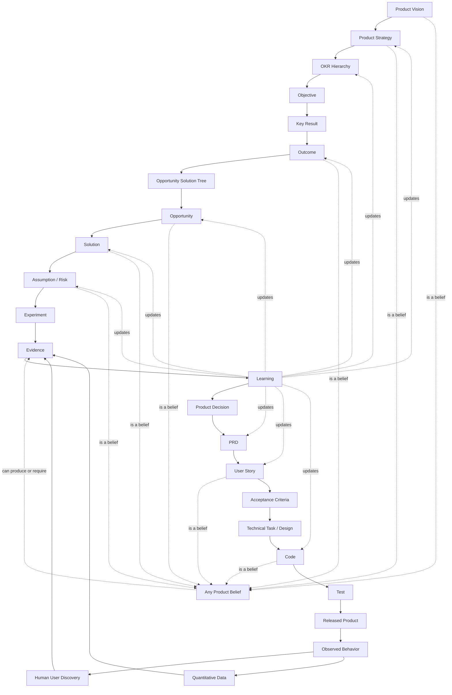
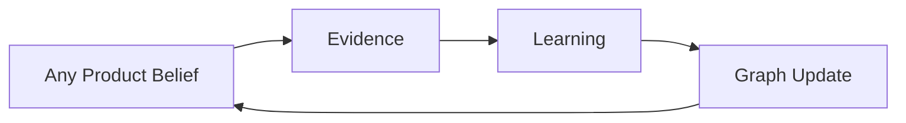

# Concept Graph

The Outcome Engineering graph connects product concepts by meaning, not just by process order.

## High-Level Graph



## Objective, Key Result, Outcome

Objective, key result, and outcome are related, but not the same.

```text
Objective = the qualitative direction
Key Result = the measurable proof of progress
Outcome = the actual change in user, customer, or business behavior/state
```

Example:

```text
Objective:
Make onboarding feel effortless for new teams.

Key Results:
- Increase activation rate from 38% to 55%.
- Reduce median time-to-first-value from 2 days to 30 minutes.
- Reduce onboarding-related support tickets by 40%.

Outcomes:
- New users complete setup without help.
- Teams invite coworkers during the first session.
- Users reach the first valuable moment faster.
```

A key result often measures an outcome. It is not itself the outcome.

## Edge Meanings

```text
Vision -> Strategy
Strategy chooses how to pursue the vision.

Strategy -> OKRs
OKRs express the current strategic focus.

Objective -> Key Result
Key results define how progress toward an objective is measured.

Key Result -> Outcome
Outcomes describe the real-world change that should move the key result.

Outcome -> OST
An opportunity solution tree explores how to create the outcome.

Opportunity -> Solution
Solutions are possible interventions for a discovered opportunity.

Solution -> Assumption
Assumptions are the beliefs that must be true for the solution to work.

Assumption -> Experiment
Experiments are designed to produce evidence about assumptions.

Evidence -> Learning
Evidence changes what the team believes.

Learning -> Decision
Decisions apply learning to the product graph.

Decision -> PRD
The PRD captures the chosen direction for delivery.

PRD -> User Story
Stories express the product behavior to build.

User Story -> Acceptance Criteria
Acceptance criteria define how the behavior is verified.

Acceptance Criteria -> Code
Code implements the accepted behavior.

Code -> Test
Tests verify implementation against expected behavior.
```

## Distributed Evidence

Evidence can attach anywhere in the graph. It should not be modeled as only post-release telemetry.



Examples of product beliefs:

- An opportunity is real.
- A solution is desirable.
- An assumption is risky.
- A prototype is understandable.
- A technical approach is feasible.
- A released change moved the outcome.
